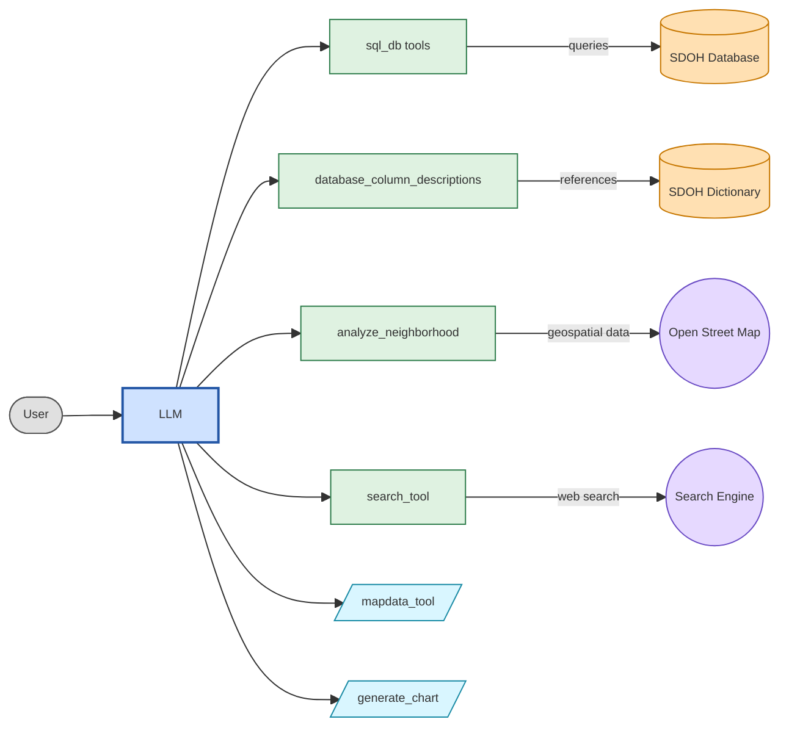

## Architecture

The assistant is configured as four docker containers.

~~~mermaid
flowchart LR
  %% Compose containers (safe IDs, rectangular)
  subgraph Docker_Compose
    DA1["da-assistant"]
    DB1["da-assistant-db"]
    ETL1["da-assistant-etl"]
    OSM1["da-assistant-osm-mcp"]
  end

  %% External actors / data stores (data stores as cylinders)
  Browser1((Browser))
  Dict1[(Dictionary)]
  Postgres1[(Postgres)]
  OSMServer1["OpenStreetMap"]
  OpenAI1["OpenAI"]

  %% Connections (use -- "label" --> form for labels)
  Browser1 -- "HTTP (Streamlit)" --> DA1
  Browser1 -- "HTTP (JupyterLab)" --> ETL1
  DA1 -- "reads / writes" --> Dict1
  DA1 -- "DB connection" --> DB1
  DA1 -- "OSM MCP API (HTTP)" --> OSM1
  DA1 -- "OpenAI API (HTTPS)" --> OpenAI1

  DB1 -- "persists data" --> Postgres1
  ETL1 -- "DB access" --> DB1

  OSM1 -- "fetch tiles / data" --> OSMServer1

  %% Zettlr-safe styles with larger font
  style DA1 fill:#f3f6ff,stroke:#2b6cff,stroke-width:1px,font-size:30px
  style DB1 fill:#f3f6ff,stroke:#2b6cff,stroke-width:1px,font-size:30px
  style ETL1 fill:#f3f6ff,stroke:#2b6cff,stroke-width:1px,font-size:30px
  style OSM1 fill:#f3f6ff,stroke:#2b6cff,stroke-width:1px,font-size:30px

  style Browser1 fill:#fff7e6,stroke:#ffa500,stroke-width:1px,font-size:30px
  style Dict1 fill:#fff7e6,stroke:#ffa500,stroke-width:1px,font-size:30px
  style Postgres1 fill:#fff7e6,stroke:#ffa500,stroke-width:1px,font-size:30px
  style OSMServer1 fill:#fff7e6,stroke:#ffa500,stroke-width:1px,font-size:25px

  style OpenAI1 fill:#fff7e6,stroke:#0077cc,stroke-width:1px,font-size:30px

  style Docker_Compose fill:#ffffff,stroke:#dddddd,stroke-width:0.5px,font-size:14px

~~~

**da-assistant** provides the Streamlit + LangChain application. The assistant uses a LangChain agent that requests LLM services from OpenAI. It exposes tools for accessing the data dictionary, the database, and an MCP server for Open Street Map.

**da-assistant-db** provides the Postgres database and implements statistical functions.

**da-assistant-osm-mcp** maintains MCP session context for retrieving OpenStreetMap features around a given location.

**da-assistant-etl** provides a JupyterLab environment for ETL notebooks. The notebooks load the database and the dictionary of database entities.

The assistant is implemented as a Streamlit chat app using a LangChain ReAct agent. The agent iteratively reasons and acts to solve tasks: it selects tools, executes them, observes the results, and continues until it produces a final answer.

The Data Analytics Assistant tools are shown below.

1. **sql_db_list_tables** – Lists all tables in the database.

2. **sql_db_schema** – Shows the schema and sample rows for specific tables.

3. **database_column_descriptions** – Finds relevant tables and columns using natural-language descriptions.

4. **sql_db_query_checker** – Validates SQL queries before execution.

5. **sql_db_query** – Executes validated SQL queries.

6. **sql_db_list_statistical_functions** – Lists statistical functions defined in the database.

7. **generate_chart** – Generates matplotlib chart code from natural-language prompts.

8. **analyze_neighborhood** – Analyzes geographic points and SDOH-related metric groups.

9. **mapdata_tool** – Converts geographic features into map-ready structures.

10. **search_tool** – Searches the internet when enabled (optional; see **Tailoring the Configuration**).
