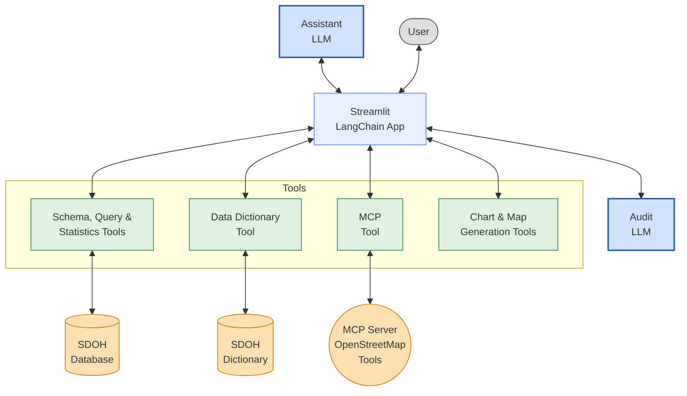

## Architecture

The assistant is configured as four docker containers.

~~~mermaid
flowchart LR
  %% Compose containers (safe IDs, rectangular)
  subgraph Docker_Compose
    DA1["da-assistant"]
    DB1["da-assistant-db"]
    ETL1["da-assistant-etl"]
    OSM1["da-assistant-osm-mcp"]
  end

  %% External actors / data stores (data stores as cylinders)
  Browser1((Browser))
  Dict1[(Dictionary)]
  Postgres1[(Postgres)]
  OSMServer1["OpenStreetMap"]
  OpenAI1["OpenAI"]

  %% Connections (use -- "label" --> form for labels)
  Browser1 -- "HTTP (Streamlit)" --> DA1
  Browser1 -- "HTTP (JupyterLab)" --> ETL1
  DA1 -- "reads / writes" --> Dict1
  DA1 -- "DB connection" --> DB1
  DA1 -- "OSM MCP API (HTTP)" --> OSM1
  DA1 -- "OpenAI API (HTTPS)" --> OpenAI1

  DB1 -- "persists data" --> Postgres1
  ETL1 -- "DB access" --> DB1

  OSM1 -- "fetch tiles / data" --> OSMServer1

  %% Zettlr-safe styles with larger font
  style DA1 fill:#f3f6ff,stroke:#2b6cff,stroke-width:1px,font-size:30px
  style DB1 fill:#f3f6ff,stroke:#2b6cff,stroke-width:1px,font-size:30px
  style ETL1 fill:#f3f6ff,stroke:#2b6cff,stroke-width:1px,font-size:30px
  style OSM1 fill:#f3f6ff,stroke:#2b6cff,stroke-width:1px,font-size:30px

  style Browser1 fill:#fff7e6,stroke:#ffa500,stroke-width:1px,font-size:30px
  style Dict1 fill:#fff7e6,stroke:#ffa500,stroke-width:1px,font-size:30px
  style Postgres1 fill:#fff7e6,stroke:#ffa500,stroke-width:1px,font-size:30px
  style OSMServer1 fill:#fff7e6,stroke:#ffa500,stroke-width:1px,font-size:25px

  style OpenAI1 fill:#fff7e6,stroke:#0077cc,stroke-width:1px,font-size:30px

  style Docker_Compose fill:#ffffff,stroke:#dddddd,stroke-width:0.5px,font-size:14px

~~~

**da-assistant** provides the Streamlit + LangChain application. The assistant uses a LangChain agent that requests LLM services from OpenAI. It exposes tools for accessing the data dictionary, the database, and an MCP server for Open Street Map.

**da-assistant-db** provides the Postgres database and implements statistical functions.

**da-assistant-osm-mcp** maintains MCP session context for retrieving OpenStreetMap features around a given location.

**da-assistant-etl** provides a JupyterLab environment for ETL notebooks. The notebooks load the database and the dictionary of database entities.

The assistant is implemented as a Streamlit chat app using a LangChain ReAct agent. The agent iteratively reasons and acts to solve tasks: it selects tools, executes them, observes the results, and continues until it produces a final answer.

The Data Analytics Assistant architecture is shown below.  The Assistant is implemented as a Streamlit LangChain application.  The application manages the flow between the user, an LLM and tools.  When the final response is produced the application provides an option to audit the process using a different LLM.

The LLM used as an assistant has access to the following tools.

#### Schema, Query, and Statistics Tools

These tools provide controlled access to a PostgreSQL database. A demonstration database is provided containing Social Determinants of Health (SDOH) metrics derived from **American Community Survey (ACS)** data published by the U.S. Census Bureau.

* **sql_db_list_tables** – Lists all tables in the database.

* **sql_db_schema** – Shows schemas and sample rows for specified tables.

* **sql_db_query_checker** – Validates SQL queries prior to execution.

* **sql_db_query** – Executes validated SQL queries.

* **sql_db_list_statistical_functions** – Lists statistical functions defined in the database.

#### Data Dictionary Tool

The **database_column_descriptions** tool identifies relevant tables and columns using natural-language descriptions. The dictionary is implemented as a vector database of embeddings. The demonstration is based on a dictionary of American Community Survey (ACS) metrics.

#### MCP Tool

The MCP Tool is a generalized interface that communicates with tools exposed by an MCP server. The MCP server provides tools for retrieving and analyzing geospatial data from OpenStreetMap.

A demonstration tool, **analyze_neighborhood**, returns Social Determinants of Health–related geographic features within a specified distance of a geographic center.

### Chart & Map Generation Tools

The application renders charts and maps using data produced by multiple tools.

* **generate_chart** – Generates matplotlib chart code from natural-language prompts.

* **mapdata_tool** – Converts OpenStreetMap-derived data into a structure suitable for rendering Leaflet maps.

